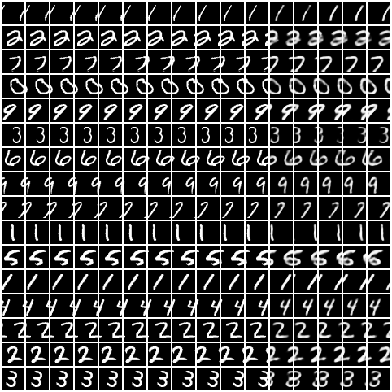
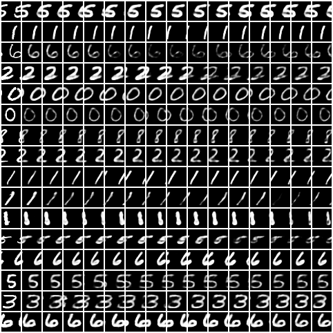

# TD-VAE

TD-VAE implementation in PyTorch 1.0.

This code implements the ideas presented in the paper [Temporal Difference Variational Auto-Encoder (Gregor et al)][2]. This implementation includes configurable number of stochastic layers as well as the specific multilayer RNN design proposed in the paper.

**NOTE**: This implementation also makes use of [`pylego`][1], which is a minimal library to write easily extendable experimental machine learning code.

## Results

Here are the results on Moving MNIST, where the context length is 11, and the last 5 images in each row are generated by jumpy prediction from the model. This is the same setting as the one presented in the paper.

Here are the results on Moving MNIST, where the context length is 1, and the remaining 15 images in each row are generated by jumpy prediction from the model. This shows the model sampling a direction and jumpy transitioning through the states without having enough information in the context.

[1]: https://github.com/ankitkv/pylego
[2]: https://arxiv.org/abs/1806.03107
